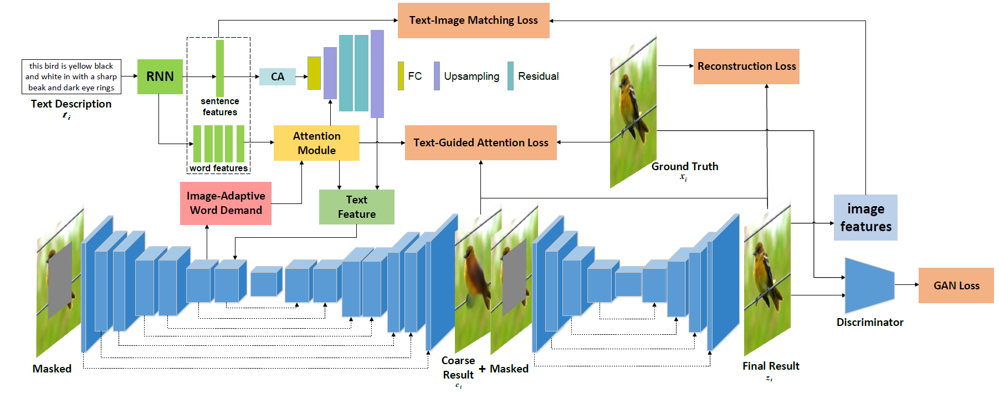

# MMFL-Multimodal-Fusion-Learning-for-Text-Guided-Image-Inpainting

## Abstract
Painters can successfully recover severely damaged objects, yet current inpainting algorithms still can not achieve this ability. Generally, painters will have a conjecture about the seriously missing image before restoring it, which can be expressed in a text description. This paper imitates the process of painters' conjecture, and proposes to introduce the text description into the image inpainting task for the first time, which provides abundant guidance information for image restoration through the fusion of multimodal features. We propose a multimodal fusion learning method for image inpainting (MMFL). To make better use of text features, we construct an image-adaptive word demand module to reasonably filter the effective text features. We introduce a text guided attention loss and a text-image matching loss to make the network pay more attention to the entities in the text description. Extensive experiments prove that our method can better predict the semantics of objects in the missing regions and generate fine grained textures.

## Model Architecture

### Image-Adaptive Word Demand

### Text Guided Attention Loss

## Datasets
We use [CUB-200-2011](http://www.vision.caltech.edu/visipedia/CUB-200.html), [Flowers](https://www.robots.ox.ac.uk/~vgg/data/flowers/102/) and [CelebA](http://mmlab.ie.cuhk.edu.hk/projects/CelebA.html) datasets. Download these datasets and save them to `data/`.

## Training
* Follow [AttnGAN](https://github.com/taoxugit/AttnGAN) to pre-train the DAMSM model and save it to `DAMSMencoders/`.
* Divide the dataset into train/test set. Run `python train.py`

## Text Guided Controllable Face Inpainting

## Acknowledgments
We benefit a lot from [CSA](https://github.com/KumapowerLIU/CSA-inpainting), [CSA_pytorch](https://github.com/Yukariin/CSA_pytorch) and [AttnGAN](https://github.com/taoxugit/AttnGAN).
